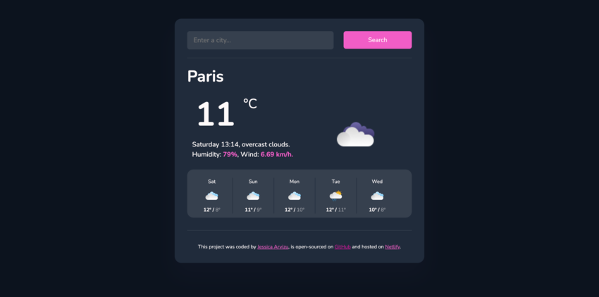

# SheCodes Plus Final Project

This is a solution to the [SheCodes Plus Workshop Final Project](https://www.shecodes.io/workshops). SheCodes has multiple Online Coding Workshops made exclusively for women. Has a unique methodology and flexible schedules.

## Table of contents

- [Overview](#overview)
  - [The challenge](#the-challenge)
  - [Screenshot](#screenshot)
  - [Links](#links)
- [My process](#my-process)
  - [Built with](#built-with)
- [Author](#author)

## Overview

### The challenge

The Weather App challenge requires participants to create a functional and aesthetically pleasing Weather App with specific features. The primary focus is on improving the existing project by enhancing the search engine, API integration, and incorporating real-time data for wind speed, weather description, and weather icon. The challenge encourages participants to host their projects on Netlify, ensuring accessibility and a seamless user experience.

- Key Requirements
  - Search Engine Enhancement:
    - Participants are expected to refine the search engine functionality, allowing users to easily find and access weather information for their desired locations.

  - API Integration:
    - A crucial aspect of the challenge involves integrating a reliable and up-to-date weather API. This ensures that the weather information displayed is accurate and reflects the current conditions.

  - Wind Speed:
    - The project should display real-time wind speed information, contributing to a comprehensive understanding of the weather conditions at the selected location.
    
  - Weather Description:
    - Participants must include a feature that provides a clear and concise description of the current weather conditions. This could include information such as clear skies, rain, snow, etc.

  - Weather Icon:
    - Incorporation of weather icons is mandatory to visually represent the current weather status. Icons can enhance user experience by offering a quick and intuitive way to understand weather conditions.

  - No Fake Data:
    - The challenge emphasizes the importance of authenticity. All data displayed in the Weather App should be sourced from the integrated API, ensuring accurate and real-time information for users.

  - Optional Feature
    - Forecast (Optional):
      - While not mandatory, participants are encouraged to include a forecast feature. This could provide users with insights into the upcoming weather conditions, allowing for better planning.

### Screenshot

### Links

- Live Site URL: [Add live site URL here](https://vocal-valkyrie-8703d3.netlify.app/)

## My process

### Built with

- Semantic HTML5 markup
- CSS custom properties
- Flexbox
- CSS Grid
- [Sass](https://sass-lang.com/)
- [BootStrap](https://getbootstrap.com/) 
- [SheCodes](https://www.shecodes.io/) - Exclusive Weather API.
- [Axios](https://axios-http.com/)

## Author

- Website - [Jessica Arvizu](https://www.linkedin.com/in/jessica-arvizu/)
